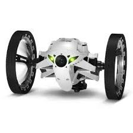
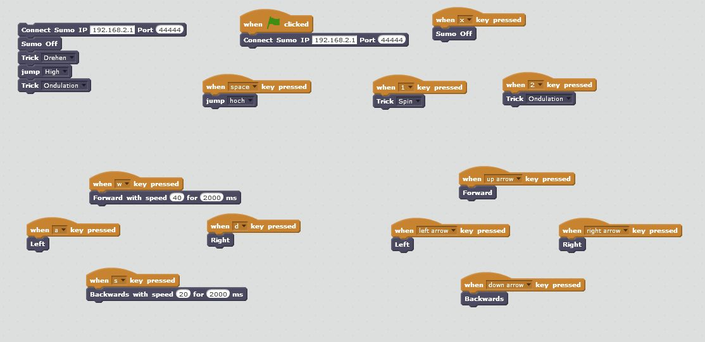

#   Sumo4scratch  
*von Stefan Höhn*

-- (beta Version) --

[Tobias Schneider]: https://github.com/derTobsch
[Scratch-Offline-Editor]: https://scratch.mit.edu/scratch2download/
[Jumping Sumo Drone]: http://www.parrot.com/usa/products/jumping-sumo/
[Parrot]: http://www.parrot.com/
[sumo4scratch]: https://github.com/Devoxx4KidsDE/sumo4scratch

## Einleitung

Dies ist ein Workshop, welcher den Kindern erlaubt die "Jumping Sumo" mit dem [Scratch-Offline-Editor] zu kontrollieren.

## Anleitung

Alles was benötigt wird ist mit im Download. Kurz gesagt braucht man diese Dinge:

* Den [Scratch-Offline-Editor] , welchen man einfach downloaden und installieren kann. Auf Mac als auch auf Windows
* Die **bridge application** die es scratch erlaubt mit dem Jumping Sumo zu sprechen. Wenn du an der Application interessiert bist, kannst du dir das project [sumo4scratch] auf 
 github anschauen. Das Projekt nutzt eine Bibliothek welche das Dronen-Protokoll
 implementiert, welches von [Tobias Schneider] implementiert wurde.
* Eine **erweiterung für Scratch** die Scratch erlaubt die Kommandos für den Jumping Sumo
  zu kennen
* **Laufende Beispiele** wie es innerhalb von Scratch zu nutzen ist, gibt es in [german](./Scratch/de/sumo-programm.sb2) und in [english](./Scratch/en/sumo-programm.sb2)
* Ein vollständiger Workshop der, für die Kinder und Mentoren, Schritt für Schritt alles 
  erklärt

### Installiere Adobe Air 2.6.0 auf Ubuntu 16.10

#### 64 Bit Version
```
wget -O adobe-air_amd64.deb http://drive.noobslab.com/data/apps/AdobeAir/adobeair_2.6.0.2_amd64.deb
```
Ignoriert die dependency Fehler hier:  

### 32 Bit Version
```
wget -O adobe-air_i386.deb http://drive.noobslab.com/data/apps/AdobeAir/adobeair_2.6.0.2_i386.deb
```
Ignoriert die dependency Fehler hier: 
```
sudo dpkg -i adobe-air_i386.deb
sudo apt-get install -f && rm adobe-air_i386.deb
```

### Installiere Adobe Air 2.6.0 auf Ubuntu 16.04/14.04/12.04/Linux Mint 18/17/13
```
wget -O adobe-air.sh http://drive.noobslab.com/data/apps/AdobeAir/adobe-air.sh
chmod +x adobe-air.sh;sudo ./adobe-air.sh
```
zum deinstallieren: 
```
sudo apt-get autoremove adobeair
```
* Siehe See [Setup Scratch to Sumo4Scratch](https://github.com/Devoxx4KidsDE/workshop-jumping-sumo-4-scratch#setup-scratch-to-sumo4scratch)

### Die Bridge starten

* Der Download enthält den voll funktionsfähigen Server (Bridge). Gehe in das 
  sumo4scratch-1.0/bin Verzeichnis und starte den Server welcher den Jumping Sumo mit 
  Scratch verbindet, indem man ./sumo4scratch (Bei Linux oder Max - sicher gehen das,
  die Datei ausführbar ist mit "chmod 777") oder sumo4scratch.bat (auf Windows)

* Sobald der Server gestartet ist kommt "Application started" in der Konsole. Man kann
  auch testen ob der Server läuft, indem man auf http://localhost:9000/monitor geht.
  
* Dann wechsle auf den Jumping Sumo. Die Drone stellt ein Wifi Netzwerk zur verfügung wenn  sie komplett gestartet ist. (Die Augen werden Grün). Wähle dieses Netzwerk auf dem
  Computer aus und verbinde dich damit.

* Nun folge den nächsten Schritten um Scratch zu starten

### Konfiguriere Scratch auf Sumo4Scratch

*Sprachauswahl für die Erweiterung*: Es gibt zwei verschiedene Erweiterungsdateien. In 
 Deutsch und in Englisch.

[sumo4Scratch.s2e-german]:  https://github.com/Devoxx4KidsDE/sumo4scratch/tree/master/Scratch/de/sumo4Scratch_de.s2e
[sumo4Scratch.s2e-english]: https://github.com/Devoxx4KidsDE/sumo4scratch/tree/master/Scratch/en/sumo4Scratch_en.s2e
[Scratch directory]:  https://github.com/Devoxx4KidsDE/sumo4scratch/tree/master/Scratch/

* Downloade das [Scratch directory] von github und speicher es an einem passenden Platz, 
  da du hier später das [sumo4Scratch.s2e-german] oder [sumo4Scratch.s2e-english] öffnen 
  musst
* Der [Scratch-Offline-Editor] von Scratch muss am laufen sein.
* Nachdem man Scratch gestartet hat, öffne "File" und drücke dabei *SHIFT* um einen 
  geheimen menü Eintrag zu öffnen "Import Experimental Extension". Jetzt kann man die 
  Datei [sumo4Scratch.s2e-german] oder [sumo4Scratch.s2e-english], welche dann geladen
  wird.
* Dann in die "more block" section des skript tab und dort erkennt man die Jumping Sumo 
  section.
* Lege die Blocks in den Code und viel Spaß.
* noch eine weitere Sache: natürlich muss man zuerst das wireless mit dem Sumo verbinden
  um sich damit zu verbinden
* Die Dateien "sumo-programm_de.sb2" und "fotovideo.sb2" sind Beispiele, die man im 
  Scratch-Editor öffnen kann. Das Letztere gibt eine Idee wie man die Video Funktionalität  zusammen mit der Web-Page (http://localhost:9000/monitor) nutzen kann.

[localization-behaviour]: https://scratch.mit.edu/discuss/topic/191003/
*Note:* In der akutellen Scratch version die ich benutze (445.2, gibt es für Erweiterungen keinen kompletten Support für Lokalisierungen. Scratch scheint die Erweiterungs 
 konfiguration in deinem Programm zu haben. Siehe mehr darüber hier [localization-behaviour]

## Nutzung von Sumo für Scratch

Die Nutzung der Blocks ist direkt und eher offensichtlich. 

* Important: nutze den "Verbindung" Block ("Connect Sumo") zuerst, wenn ein Scratch 
  Programm gestartet ist. ("wenn auf die Grüne Flagge gedrückt wurde").
  Mit dem Block kann man definieren mit welcher Drone du dich verbinden möchtest.
  Die gegebenen Beispiel-Programme (Siehe unten) machen es genauso.
* Es gibt auch einen *Sumo off* mit dem man disconnecten kann. 
* Nun kannst du den Sumo
    * In jede Richtung bewegen
    * drehen indem du die Winkel angibst
    * Hoch und Weit springen lassen
    * ein paar __tricks__ machen lassen
     

[sumo-programm_de.sb2]: https://github.com/Devoxx4KidsDE/sumo4scratch/tree/master/Scratch/de/sumo-programm.sb2
[sumo-programm_en.sb2]: https://github.com/Devoxx4KidsDE/sumo4scratch/tree/master/Scratch/en/sumo-programm.sb2

Es gibt ein __sample program__  für Scratch mit __jeder__ Sprache die du im root 
Verzeichnis des Projektes finden kannst. [sumo-programm_de.sb2] oder [sumo-programm_en.sb2] .

So sieht es in Scratch aus: 


und hier noch einmal in Englisch: 



