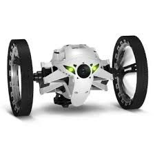

#   Sumo4scratch  
*from Stefan Höhn*

-- (beta version) --

[Tobias Schneider]: https://github.com/derTobsch
[Scratch-Offline-Editor]: https://scratch.mit.edu/scratch2download/
[Jumping Sumo Drone]: http://www.parrot.com/usa/products/jumping-sumo/
[Parrot]: http://www.parrot.com/
[sumo4scratch]: https://github.com/Devoxx4KidsDE/sumo4scratch

## Introduction

This is a workshop that allows kids to control the Jumping Sumo with the [Scratch-Offline-Editor]. As you will see the kids have a lot of fun to play around with that jumping drone.


## Instructions

Everything you need is supplied within the download. Basically you need the following items

* The [Scratch-Offline-Editor] which you can just download and install for Mac or Windows
* The **bridge application** that allows Scratch to talk to the Jumping Sumo. It is part of this download. If you are interested to have a closer look at that application you can find the project [sumo4scratch] on github. The project again uses a library that implements the drone protocol which was implemented by [Tobias Schneider]
* An **extension for Scratch** to allow Scratch to know the commands for the Jumping sumo
* **Running Samples** how to use it within Scratch that can be found in [german](./Scratch/de/sumo-programm.sb2) or in [english](./Scratch/en/sumo-programm.sb2)
* a complete workshop that shows step by step instructions for the kids and the mentor

### Getting started with Ubuntu 16.10

* Install Adobe Air 2.6.0
```
wget -O adobe-air_amd64.deb http://drive.noobslab.com/data/apps/AdobeAir/adobeair_2.6.0.2_amd64.deb
sudo apt-get install -f && rm adobe-air_amd64.deb
```
* See Setup Scratch to Sumo4Scratch

### Running the bridge

* The download contains the fully functional server (brigde). Go to the sumo4scratch-1.0/bin directory and start the server that connects the jumping sumo with a Scratch by typing ./sumo4scratch (on linux or max - in case execution does not work make sure the file is executable by applying "chmod 777") or sumo4scratch.bat (on windows).

* When the server it is up it will say "Application started" in the console. You can also check if the server is running by going to http://localhost:9000/monitor. If you are provided with web page with a mars environment the server is running fine.

* Then switch on the Jumping Sumo. The drone will provide a wifi network after it has fully started (they eyes will turn green). Choose that wifi network on you computer and connect to it.

* Now follow the next steps to start Scratch


### Setup Scratch to Sumo4Scratch

*Language of the extension*: Two different extension files are provided for German and English.

[sumo4Scratch.s2e-german]:  https://github.com/Devoxx4KidsDE/sumo4scratch/tree/master/Scratch/de/sumo4Scratch_de.s2e
[sumo4Scratch.s2e-english]: https://github.com/Devoxx4KidsDE/sumo4scratch/tree/master/Scratch/en/sumo4Scratch_en.s2e

* Download the file [sumo4Scratch.s2e-german] or [sumo4Scratch.s2e-english] from github and save it at a convenient place as you need to open it from Scratch later on.
* You need to have the [Scratch-Offline-Editor] of Scratch running
* After you have started Scratch, open "File" while *holding SHIFT* at the same time. This reveals a secret menu entry "Import Experimental Extension". Now you can chose the file [sumo4Scratch.s2e-german] or [sumo4Scratch.s2e-english] which will be loaded by scratch.
* Then you can go to the "more block" section of script tab and you will recognize the Jumping Sumo section.
* Drop the blocks into the code and have fun.
* One more thing: of course you need to connect your wireless to the sumo first to be able to connect to it.
* You can find examples files that you can open in the Scratch Editor, namely "sumo-programm_de.sb2" and "fotovideo.sb2". The latter shows an idea how you can use the video functionality together with the web page (http://localhost:9000/monitor), which is a lot of fun.

[localization-behaviour]: https://scratch.mit.edu/discuss/topic/191003/
*Note:* In the current Scratch version I am using (445.2), extensions do not really have a complete support for localizations. Scratch seems to save the extension configuration in your program. See more at this description where I explained that [localization-behaviour].

## Using Sumo for Scratch

The usage of the blocks is straight forward and rather obvious.

* Important: use the *Connection* Block ("Connect Sumo") first, when a scratch program is started ("when green flag clicked"). With the block you can define to which drone you like to connect. The provided example programs (see below) exactly do it that way.
* There is also a *Sumo off* with which you can disconnect that can be used. Of course, after that you need use the *Connect* again
* Now you can
	* Move in any direction (even with providing __speed and time__)
	* Turn by providing the angle in degrees
	* Jump high and far
	* Do some __tricks__

[sumo-programm_de.sb2]: https://github.com/Devoxx4KidsDE/sumo4scratch/tree/master/Scratch/de/sumo-programm.sb2
[sumo-programm_en.sb2]: https://github.com/Devoxx4KidsDE/sumo4scratch/tree/master/Scratch/en/sumo-programm.sb2

There is a __sample program__ for Scratch for __each__ language that you can find in the root directory of the project which is called [sumo-programm_de.sb2] or [sumo-programm_en.sb2] .

This is how it looks like in Scratch:


and here is the German version:


